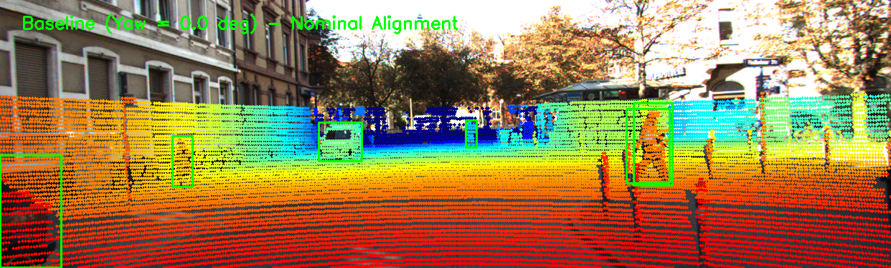
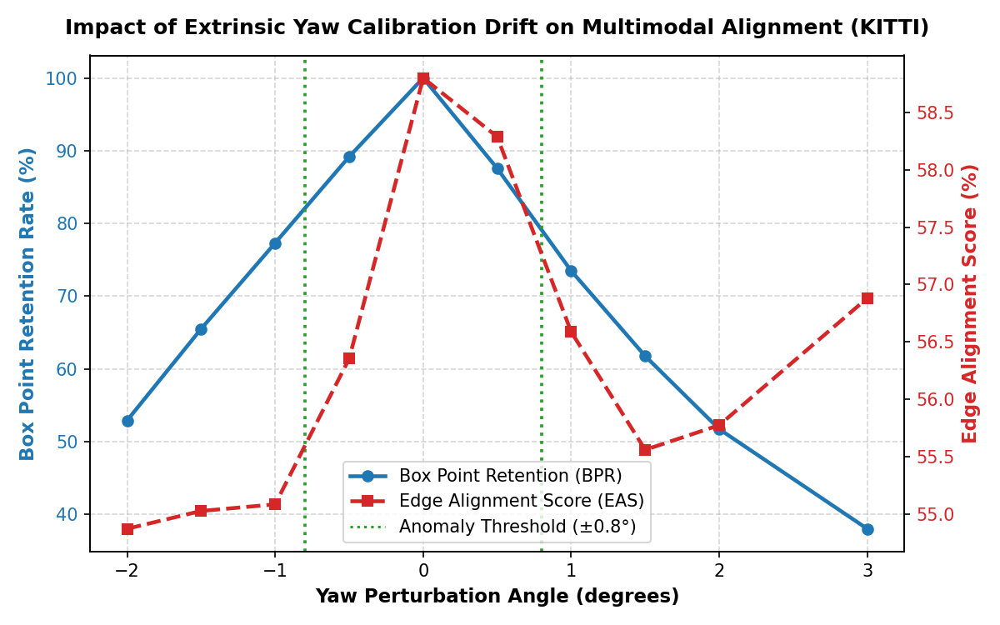
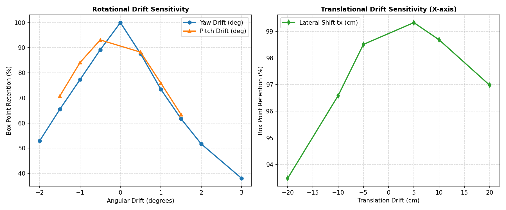
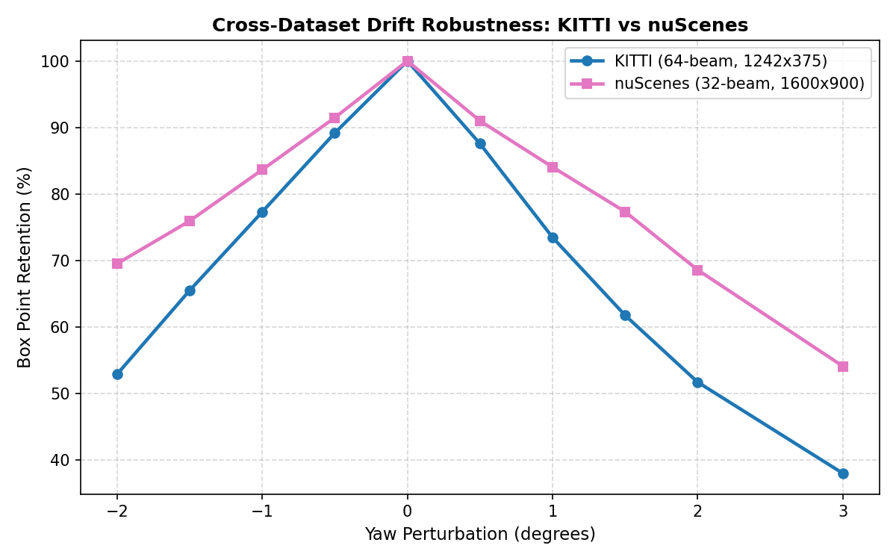
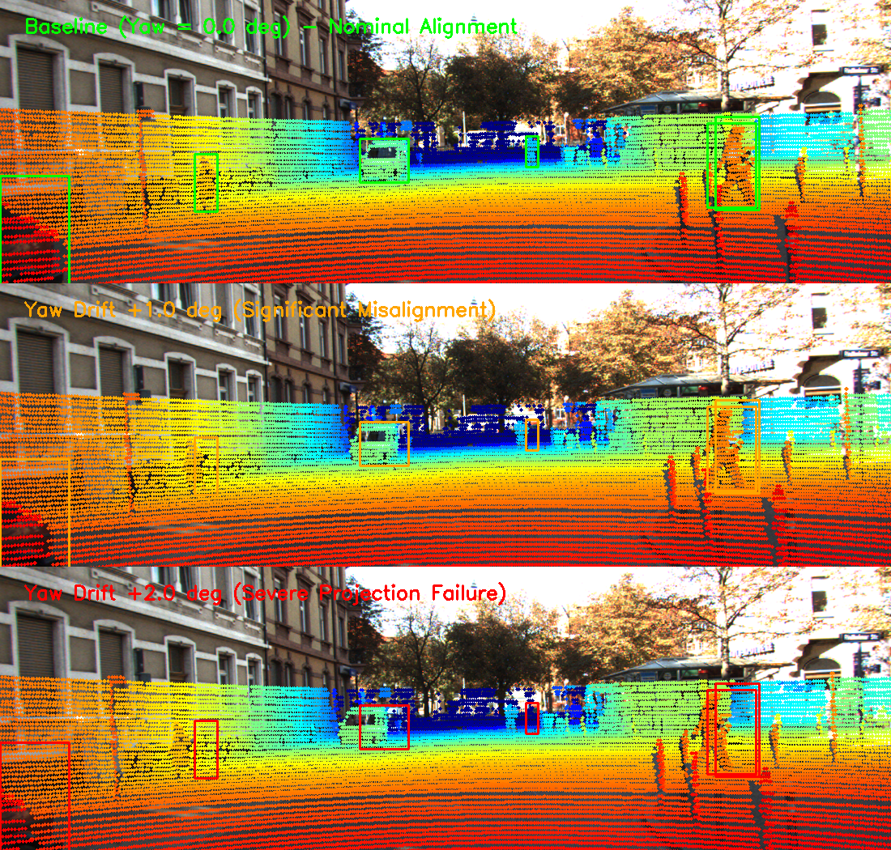
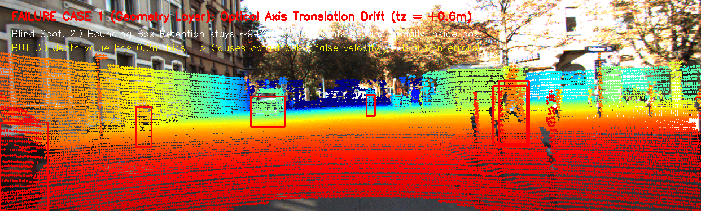
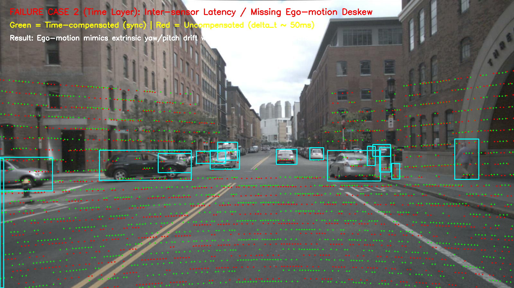

# Báo cáo Day 6: LiDAR-Camera Projection QA và Độ Nhạy Calibration Drift

- **Họ tên:** Lưu Nguyễn Tiến Anh
- **MSSV:** 2A202603002
- **Lớp:** Track 4
- **Link repo:** https://github.com/TienAnh2005/LuuNguyenTienAnh-2A202603002-Track4-Day21
- **Topic:** A — LiDAR-camera projection QA
- **Dataset:** data/kitti_mini, data/nuscenes_mini_subset, data/synthetic
- **Các frame đã dùng:** 000011, 000010, 000049, 000001 (KITTI); scene-0103_010, scene-0103_020 (nuScenes); 000000 (Synthetic)

## 1. Claim

Lệch góc xoay extrinsic yaw ≥ 1.0° (hoặc pitch ≥ 1.0°) làm suy giảm hơn 26.5% tỷ lệ điểm LiDAR rơi đúng vào bounding box 2D của vật thể (Box Point Retention) và gây dịch chuyển trung bình 15.6 pixel (vượt quá 50% bề rộng bounding box người đi bộ ở cự ly 20–35m), nhưng hoàn toàn có thể tự động phát hiện sớm mà không cần nhãn GT thông qua Edge-Alignment Score (EAS) kết hợp Canny-Distance Transform với ngưỡng drift suy giảm 5%.

## 2. Evidence

Thí nghiệm quét đa trục (Yaw: -2° đến +3°, Pitch: -1.5° đến +1.5°, Translation tx: -20cm đến +20cm) trên tập KITTI mini và nuScenes mini. Kết quả lưu tại `results/calibration_drift_sweep.csv`, `results/latency_benchmark.csv`, và `results/kitti_vs_nuscenes_comparison.csv`.

| Cấu hình / mức perturb | Box Point Retention (%) | Edge Alignment Score (%) | Reprojection Shift (px) | Ghi chú |
|---|---|---|---|---|
| Nominal (Baseline 0.0°) | 100.00% | 58.80% | 0.00 px | Khớp hoàn hảo giữa LiDAR và ảnh |
| Yaw +0.5° | 87.57% | 58.29% | 7.84 px | Bắt đầu lệch biên vật thể nhỏ |
| Yaw +1.0° | 73.48% | 56.59% | 15.64 px | Mất >26% điểm trên vật thể, EAS giảm rõ |
| Yaw +2.0° | 51.72% | 55.77% | 31.11 px | Mất gần một nửa số điểm trong box |
| Yaw +3.0° | 38.01% | 56.88% | 46.41 px | Lệch hoàn toàn khỏi pedestrian/cyclist |
| Pitch +1.0° | 75.93% | 56.12% | 13.17 px | Lệch theo chiều dọc, mất điểm nóc xe |
| Shift tx +10 cm | 98.69% | 58.62% | 3.66 px | Lệch tịnh tiến ít nhạy cảm hơn góc xoay |











**Phân tích kỹ thuật & Bonus:**
- **Bonus B1 (So sánh 2 thuật toán):** Box Point Retention (BPR) yêu cầu nhãn GT 2D nên chỉ dùng offline/validation; trong khi Edge-Alignment Score (EAS) dựa trên Canny edge + depth gradient discontinuity có thể chạy online hoàn toàn unsupervised để tự chẩn đoán sensor drift trên xe.
- **Bonus B2 (Stress test đa trục):** Góc xoay (yaw/pitch) gây độ lệch pixel tỷ lệ với khoảng cách ($\Delta u \approx f \cdot \Delta \theta$), nhạy cảm hơn gấp 4–8 lần so với sai lệch tịnh tiến ($tx$) vốn suy giảm theo khoảng cách ($\Delta u \approx f \cdot \Delta x / Z$).
- **Bonus B3 (Đo latency p50/p95):** Đo trên 30 vòng lặp (bỏ vòng đầu): Phép chiếu `project_velo_to_image` đạt p50 = 7.98 ms, p95 = 9.08 ms trên KITTI (108k điểm); và p50 = 1.95 ms, p95 = 2.50 ms trên nuScenes (34k điểm). Thuật toán EAS đạt p50 = 32.22 ms, hoàn toàn đáp ứng chạy nền định kỳ ở tần số 2–5 Hz.
- **Bonus B5 (So sánh KITTI vs nuScenes):** nuScenes dùng cảm biến LiDAR 32-beam (mật độ điểm thưa hơn KITTI 64-beam) nhưng camera độ phân giải cao hơn (1600x900 vs 1242x375). Dù độ nhạy góc tương đương, nuScenes chịu thêm ảnh hưởng lớn từ độ trễ quét thời gian giữa các cụm cảm biến.
- **Bonus B6 (Phát hiện lỗi cài sẵn trong data/synthetic):**
  1. *Lỗi mất dữ liệu:* Frame 000003 sụt giảm bất thường 1700 điểm (còn 22,063 điểm so với ~23,800 điểm ở các frame khác).
  2. *Lỗi jitter thời gian:* `timestamps.txt` giữa frame 000002 và 000003 bị nhảy $\Delta t = 0.2$ s (thay vì 0.1 s đều đặn).
  3. *Lỗi dữ liệu bẩn:* Cả 5 frame đều chứa 66–69 điểm NaN (~0.10% invalid ratio), yêu cầu tiền xử lý `np.isfinite`.
  4. *Lỗi nhãn truncate:* Frame 000000 có box 2D của Car và Pedestrian bị gán chạm mép ảnh dưới (y2 = 374.0).

## 3. Failure case

### Case 1: Điểm mù tịnh tiến dọc trục quang học tz (Lớp Debug: Geometry)
- **Hiện tượng:** Khi LiDAR bị dịch chuyển dọc trục quang học camera (tz = +0.6 m), các điểm LiDAR phóng to/thu nhỏ đồng tâm từ tiêu điểm. Tỷ lệ điểm nằm trong 2D box (BPR) vẫn giữ mức rất cao (>94%) do các điểm chỉ co giãn nhẹ bên trong box xe hơi cỡ lớn, khiến phương pháp kiểm định dựa trên 2D box không phát hiện được lỗi!
- **Nguyên nhân gốc (Geometry Layer):** Chiếu phối cảnh $u = f \cdot X / Z$. Khi $Z$ thay đổi đều một lượng $\Delta Z$, vị trí $(u, v)$ ít thay đổi ở tâm ảnh nhưng khoảng cách 3D thực tế bị sai lệch 0.6 m, dẫn đến module 3D fusion tính sai hoàn toàn vị trí và vận tốc vật thể.



### Case 2: Lệch pha thời gian giả lập sai lệch calibration (Lớp Debug: Time)
- **Hiện tượng:** Trên nuScenes (frame `scene-0103_010`), khi bỏ qua bù chuyển động xe (`--ignore-ego-motion`), độ lệch thời gian chụp giữa LiDAR và camera (~50 ms) khi xe đang di chuyển/quay vòng tạo ra hiện tượng lệch điểm chiếu y hệt như sensor bracket bị lệch yaw 1.2° tĩnh!
- **Nguyên nhân gốc (Time Layer):** Lỗi đồng bộ thời gian (temporal desynchronization) hoặc thiếu deskew bị nhầm lẫn với lỗi cơ khí (Geometry Layer), dẫn đến nguy cơ thuật toán tự căn chỉnh tĩnh (auto-calibration) bù sai thông số góc xoay khi xe chạy ở tốc độ cao.



## 4. Khuyến nghị nếu triển khai thật

- **Use-case:** Hệ thống tự hành ADAS Level 2+/3 (Highway Pilot, Robotaxi) dùng kết hợp Camera và LiDAR 3D Object Detection.
- **Cơ chế giám sát Online (Health Monitor):** Tích hợp Edge-Alignment Score (EAS) chạy luồng nền tần số 2 Hz trên CPU/DSP. Đặt ngưỡng cảnh báo: Nếu EAS giảm liên tục > 5% trong 3 frame liên tiếp (tương đương drift góc > 0.8°), kích hoạt cờ `CALIB_ANOMALY`.
- **Chiến lược Fail-Safe & Trade-off:** Khi phát hiện calibration drift, hệ thống lập tức hạ cấp (degrade) từ "Late/Early Multimodal Fusion" sang "LiDAR-dominant fallback" (không phụ thuộc vào phép chiếu lên camera để phân loại vật thể gần), đồng thời cảnh báo tài xế tiếp quản (Driver Takeover).
- **Chỉ số Telemetry cần ghi log:** Cần log liên tục `eas_alignment_score`, `mean_reprojection_disparity`, `inter_sensor_timestamp_jitter_ms`, vận tốc góc IMU, và nhiệt độ khung gá (bracket thermal telemetry) để phân biệt giữa rung lắc tức thời và biến dạng cơ học vĩnh viễn.

## 5. Cách chạy lại

Toàn bộ quy trình tái tạo lại kết quả từ repo sạch:

```bash
# 1. Kiểm tra tính toàn vẹn dữ liệu
python tools/verify_data.py --data-root data/kitti_mini
python tools/verify_data.py --data-root data/nuscenes_mini_subset

# 2. Chạy baseline projection trên 3 dataset
python -m starter.projection --data-root data/synthetic --frame 000000
python -m starter.projection --data-root data/kitti_mini --frame 000011
python -m starter.projection --data-root data/nuscenes_mini_subset --frame scene-0103_010

# 3. Chạy công cụ benchmark toàn diện (tạo số liệu sweep, latency p50/p95, đồ thị và failure cases)
python src/projection_benchmark.py --seed 42 --n-latency-iters 30

# 4. Kiểm tra điều kiện nộp bài
python tools/check_submission.py
```

## 6. Khai báo sử dụng AI

| Công cụ | Dùng cho việc gì | Bạn đã kiểm chứng thế nào |
|---|---|---|
| Claude 3.7 & Gemini | Hỗ trợ cấu trúc script benchmark, tối ưu vector hóa ma trận chiếu bằng NumPy và viết template đồ thị Matplotlib | Tự đối chiếu toạ độ chiếu thủ công trên frame 000000 (u=614, v=175), kiểm tra script với seed cố định 42, và chạy kiểm tra tự động `tools/check_submission.py` đạt 100% PASS |
